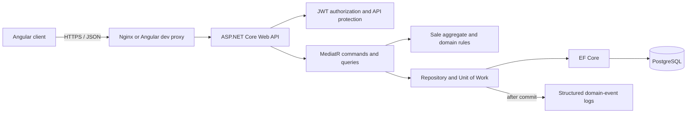

[Back to README](../README.md)

# Setup and delivery guide

This guide is the entry point for running, reviewing, testing, and demonstrating the DeveloperStore sales implementation. The original challenge requirements remain in the repository root README. The detailed sales contract is documented in [sales-api.md](sales-api.md), and its machine-readable version is available in [openapi/sales.yaml](openapi/sales.yaml).

## Delivered scope

The repository contains a complete sales vertical slice:

- a .NET 8 API organized into domain, application, persistence, infrastructure, and HTTP layers;
- PostgreSQL persistence with EF Core migrations and optimistic concurrency;
- create, detail, list, update, cancellation, item cancellation, and soft-delete operations;
- server-side discounts and totals using decimal arithmetic;
- JWT authentication with role-based authorization for `Manager` and `Admin` users;
- an Angular application for authentication and the complete sales workflow;
- structured domain-event logging after successful commits;
- unit, integration, functional, Angular, and Playwright browser tests;
- a containerized stack and GitHub Actions CI pipeline with coverage reports.

Customer, branch, and product data use external identity snapshots. They do not depend on catalog services that are outside this challenge.

## Prerequisites

The containerized path requires only:

- Git;
- Docker Engine or Docker Desktop with Docker Compose v2.

Local development outside containers additionally requires:

- .NET SDK `8.0.416`, pinned by `global.json`;
- Node.js `22.22.3` or a later Node 22 release;
- npm 10;
- the local EF Core tool restored from `.config/dotnet-tools.json`.

The delivery was validated with Docker Engine 29.1.3, Docker Compose 2.40.3, .NET SDK 8.0.416, Node.js 22.23.1, and npm 10.9.8. Later compatible patch versions should work, but the CI workflow uses the pinned versions above.

## Quick start with Docker Compose

From the repository root, copy the environment template:

```powershell
Copy-Item .env.example .env
```

Edit `.env` and provide local values:

```dotenv
POSTGRES_PASSWORD=<choose-a-local-database-password>
DATABASE_CONNECTION_STRING=Host=database;Port=5432;Database=developer_evaluation;Username=developer;Password=<use-the-same-database-password>
JWT_SECRET_KEY=<generate-a-random-value-with-at-least-32-bytes>
DATABASE_PORT=5434
API_PORT=5119
FRONTEND_PORT=4200
DEVELOPMENT_ADMIN_ENABLED=true
DEVELOPMENT_ADMIN_EMAIL=admin@example.test
DEVELOPMENT_ADMIN_PASSWORD=<choose-a-strong-local-admin-password>
```

`.env` is ignored by Git. Do not reuse these local credentials in another environment.

Build and start the complete stack:

```powershell
docker compose up --detach --build --wait --wait-timeout 240
docker compose ps
```

Compose starts PostgreSQL, runs the EF Core migration bundle once, waits for the API readiness probe, and then starts the Nginx-hosted Angular application.

| Resource                 | URL                                  |
| ------------------------ | ------------------------------------ |
| Angular application      | `http://localhost:4200`              |
| API                      | `http://localhost:5119`              |
| Swagger UI               | `http://localhost:5119/swagger`      |
| API liveness             | `http://localhost:5119/health/live`  |
| API readiness            | `http://localhost:5119/health/ready` |
| PostgreSQL from the host | `localhost:5434`                     |

Sign in through the frontend with `DEVELOPMENT_ADMIN_EMAIL` and `DEVELOPMENT_ADMIN_PASSWORD` from the local `.env` file.

Inspect logs when startup fails:

```powershell
docker compose ps --all
docker compose logs migrations webapi frontend database
```

Stop the stack while retaining database data:

```powershell
docker compose down
```

Delete the local database volume only when a complete reset is intended:

```powershell
docker compose down --volumes --remove-orphans
```

## Local development and Rider

Create the same `.env` file described above, then start PostgreSQL only:

```powershell
docker compose up --detach database
```

Restore the .NET tools and configure secrets outside committed files:

```powershell
dotnet tool restore
dotnet user-secrets set "Jwt:SecretKey" "<random-value-with-at-least-32-bytes>" `
  --project src/backend/Ambev.DeveloperEvaluation.WebApi
dotnet user-secrets set "ConnectionStrings:DefaultConnection" `
  "Host=localhost;Port=5434;Database=developer_evaluation;Username=developer;Password=<local-database-password>" `
  --project src/backend/Ambev.DeveloperEvaluation.WebApi
dotnet user-secrets set "DevelopmentAdmin:Enabled" "true" `
  --project src/backend/Ambev.DeveloperEvaluation.WebApi
dotnet user-secrets set "DevelopmentAdmin:Email" "admin@example.test" `
  --project src/backend/Ambev.DeveloperEvaluation.WebApi
dotnet user-secrets set "DevelopmentAdmin:Password" "<strong-local-admin-password>" `
  --project src/backend/Ambev.DeveloperEvaluation.WebApi
```

Apply migrations. The design-time factory reads the explicit environment variable, while the running API reads User Secrets:

```powershell
$env:ConnectionStrings__DefaultConnection = "Host=localhost;Port=5434;Database=developer_evaluation;Username=developer;Password=<local-database-password>"
dotnet tool run dotnet-ef database update `
  --project src/backend/Ambev.DeveloperEvaluation.ORM `
  --startup-project src/backend/Ambev.DeveloperEvaluation.WebApi
Remove-Item Env:ConnectionStrings__DefaultConnection
```

Open `Ambev.DeveloperEvaluation.sln` in Rider, restore packages, select the WebApi `http` launch profile, and run it. The profile listens on `http://localhost:5119` and opens Swagger in Development.

Start the Angular development server in a terminal:

```powershell
Set-Location src/frontend
npm ci
npm start
```

Open `http://localhost:4200`. The Angular development proxy forwards `/api` to `http://localhost:5119`.

## Configuration reference

| Setting                                | Purpose                                 | Delivery source                                                |
| -------------------------------------- | --------------------------------------- | -------------------------------------------------------------- |
| `ConnectionStrings__DefaultConnection` | PostgreSQL connection                   | `.env`, environment provider, or User Secrets                  |
| `Jwt__SecretKey`                       | HMAC signing key, at least 32 bytes     | `.env`, environment provider, or User Secrets                  |
| `Jwt__Issuer`                          | JWT issuer                              | committed non-secret default or environment override           |
| `Jwt__Audience`                        | JWT audience                            | committed non-secret default or environment override           |
| `Cors__AllowedOrigins__0`              | First permitted browser origin          | environment override; localhost is enabled only in Development |
| `DevelopmentAdmin__Enabled`            | Enables the idempotent development seed | local configuration only                                       |
| `DevelopmentAdmin__Email`              | Seeded development account email        | local configuration only                                       |
| `DevelopmentAdmin__Password`           | Seeded development account password     | local configuration only                                       |

The development administrator is never seeded outside the Development environment. Production must inject all secrets through its secret manager and configure explicit CORS origins.

## Architecture



| Layer       | Responsibility                                                                                                        |
| ----------- | --------------------------------------------------------------------------------------------------------------------- |
| Domain      | Sale invariants, discounts, totals, cancellation, versioning, and domain events                                       |
| Application | Commands, queries, validators, handlers, ports, and result models                                                     |
| ORM         | EF Core mappings, repositories, migrations, transaction boundary, and post-commit event publication                   |
| IoC         | Dependency registration, correlation IDs, and infrastructure bindings                                                 |
| WebApi      | HTTP contracts, authentication, authorization, ETags, error mapping, CORS, rate limiting, and health probes           |
| Frontend    | Authentication, sales list/detail/editor flows, URL-backed filters, concurrency recovery, and accessible interactions |

Writes are committed before domain events are written to structured logs. Publication is deliberately best effort; the limitations section explains the durability tradeoff.

## Sales behavior at a glance

The API calculates every discount and monetary total. Clients send quantity and unit price only.

| Quantity for one product | Discount |
| -----------------------: | -------: |
|                      1–3 |       0% |
|                      4–9 |      10% |
|                    10–20 |      20% |
|                 Above 20 | Rejected |

The main endpoints are:

| Method   | Route                                   | Purpose                                  |
| -------- | --------------------------------------- | ---------------------------------------- |
| `POST`   | `/api/auth`                             | Authenticate and obtain a JWT            |
| `GET`    | `/api/sales`                            | Filtered, ordered, paginated list        |
| `POST`   | `/api/sales`                            | Create a sale                            |
| `GET`    | `/api/sales/{id}`                       | Retrieve a sale and its `ETag`           |
| `PUT`    | `/api/sales/{id}`                       | Update using the latest `If-Match` value |
| `POST`   | `/api/sales/{id}/cancel`                | Cancel a sale using `If-Match`           |
| `POST`   | `/api/sales/{id}/items/{itemId}/cancel` | Cancel one item using `If-Match`         |
| `DELETE` | `/api/sales/{id}`                       | Soft-delete using `If-Match`             |

Sales endpoints require a bearer token with the `Manager` or `Admin` role. Mutations of existing sales require the latest strong ETag. Missing ETags return `428`; stale ETags return `412` without overwriting another session.

Use these sources for full request and response details:

- [sales-api.md](sales-api.md): business and HTTP decisions;
- [openapi/sales.yaml](openapi/sales.yaml): OpenAPI contract;
- [Ambev.DeveloperEvaluation.WebApi.http](../src/backend/Ambev.DeveloperEvaluation.WebApi/Ambev.DeveloperEvaluation.WebApi.http): runnable API examples;
- [Postman reviewer workflow](postman/README.md): an ordered collection with automatic JWT, ID, and ETag handling;
- Swagger UI in Development: interactive endpoint discovery.

For a guided API demonstration, import [the Postman collection](postman/DeveloperStore-Sales.postman_collection.json) and [local environment template](postman/DeveloperStore-Local.postman_environment.json). Set the environment's secret `adminPassword` value and run the collection in order. The requests generate unique sale numbers, capture authentication and concurrency state automatically, and clean up their successful fixtures.

The collection was also executed through Newman against a fresh disposable Compose stack: all 20 requests and 36 assertions passed, and the stack and its volumes were removed afterward.

## Demonstration script

This sequence demonstrates the business rules and the main engineering decisions in approximately ten minutes.

1. Start the stack with `docker compose up --detach --build --wait --wait-timeout 240`.
2. Open `http://localhost:4200` and sign in with the configured development administrator.
3. Create a sale with a unique sale number, one customer snapshot, one branch snapshot, and four units of a BRL 10.00 product.
4. Confirm a gross amount of BRL 40.00, a 10% discount, and a BRL 36.00 total in both the UI and detail response.
5. Edit the same line to ten units. Confirm a 20% discount and a BRL 80.00 total.
6. Open the sale in two browser tabs, save a change in the first tab, and then submit the stale form in the second. Confirm that the second draft is retained and the API returns the concurrency conflict instead of overwriting data.
7. Cancel an item and confirm that its history remains visible while its effective amount becomes zero. Cancelling the final active item also cancels the sale.
8. Return to the list and exercise sale-number, date, status, ordering, and page-size controls. Refresh the page to show that list state is encoded in the URL.
9. Delete a disposable sale and confirm it disappears from public reads without removing its database history.
10. Open `/health/live`, `/health/ready`, and Swagger. Show the structured event entries in `docker compose logs webapi`.

The deterministic Playwright suite automates these critical flows, including validation, idempotent cancellation, pagination correction, expired authentication, interrupted responses, keyboard use, mobile layout, and accessibility checks.

## Test and quality commands

Backend tests require a running Docker engine because the integration and functional suites create isolated PostgreSQL containers through Testcontainers:

```powershell
dotnet restore Ambev.DeveloperEvaluation.sln
dotnet build Ambev.DeveloperEvaluation.sln --configuration Release --no-restore
dotnet test Ambev.DeveloperEvaluation.sln `
  --configuration Release `
  --no-build `
  --logger "trx" `
  --settings .config/coverage.runsettings `
  --collect "XPlat Code Coverage" `
  --results-directory artifacts/backend
```

Run the frontend checks from `src/frontend`:

```powershell
npm ci
npm run lint
npx tsc -p tsconfig.app.json --noEmit
npm run test:ci -- `
  --coverage `
  --coverage-reporters=cobertura `
  --coverage-reporters=text-summary
npm run build
```

Install Chromium once and run the isolated browser suite:

```powershell
Set-Location src/frontend
npm run test:e2e:install
npm run test:e2e
```

The E2E runner creates random credentials in memory, starts disposable API and PostgreSQL containers, runs Angular and Playwright, and removes its containers and volumes in a `finally` block. It does not depend on manual seed data. See [the E2E guide](../src/frontend/e2e/README.md) for running against an existing environment.

## Continuous integration

The [GitHub Actions workflow](../.github/workflows/ci.yml) runs on every pull request and every push to `main`.

| Job                    | Verification                                                                                          |
| ---------------------- | ----------------------------------------------------------------------------------------------------- |
| Backend tests          | Restore, Release build, unit/integration/functional tests, TRX, and scoped Cobertura                  |
| Frontend checks        | npm lockfile restore, lint, strict typecheck, unit tests, 90% coverage gate, and production build     |
| Code coverage          | Publish separate backend/frontend reports and block below 90% lines or branches                       |
| Isolated browser suite | Run 13 Playwright scenarios against real Angular, API, and PostgreSQL processes                       |
| Container stack smoke  | Build the production-like stack, wait for health, and verify frontend, API, proxy, and authentication |

### Recorded delivery evidence

The table below is historical pre-T17 evidence from the clean GitHub-hosted run for merge commit `df4fadf` on September 25, 2026. It remains linked for traceability in [GitHub Actions run 36174441138](https://github.com/lauraizabel/OMINIA/actions/runs/36174441138).

| Suite                    |                                                                  Result |
| ------------------------ | ----------------------------------------------------------------------: |
| .NET unit                |                                                              134 passed |
| .NET functional          |                                                               54 passed |
| .NET integration         |                                                               20 passed |
| Angular                  |                                                               46 passed |
| Playwright               | 13 completed successfully; E10 passed on retry after one failed attempt |
| Compose smoke            |                                                                  Passed |
| Combined line coverage   |                                  71.5% — 3,284 of 4,591 coverable lines |
| Combined branch coverage |                                           66.1% — 675 of 1,020 branches |

The T17 branch was then verified locally with 160 unit, 97 functional, 22 PostgreSQL integration, and 81 Angular tests. The independently merged reports measured **93.4% backend lines / 90.3% backend branches** and **95.2% frontend lines / 93.7% frontend branches**. The pull-request pipeline is the authoritative clean-environment confirmation for these gates.

Reports are retained as workflow artifacts for seven days. The pipeline measures backend and frontend separately and blocks either application below 90% line or branch coverage. Backend measurement excludes only EF migrations, generated code, the declarative host bootstrap, and the design-time context factory through [the committed run settings](../.config/coverage.runsettings). Frontend measurement includes application TypeScript and Angular templates except declarative route/bootstrap configuration and test files. The percentage complements the scenario matrix; it does not replace behavior-focused assertions. The E10 retry is also tracked as a stability gap rather than being hidden by the successful job status.

## Design decisions

- **Aggregate ownership:** `Sale` owns its lines and is the only entry point for changes that affect totals or state.
- **External identities:** customer, branch, and product descriptions are stored as historical snapshots with their external IDs.
- **Calculated data:** discounts, gross values, effective values, and totals are server-owned and cannot be supplied by clients.
- **Money:** decimal arithmetic and two-digit rounding avoid binary floating-point errors.
- **Concurrency:** strong ETags and `If-Match` prevent silent last-write-wins updates.
- **Deletion:** delete is a tombstone operation; cancellation is a separate business transition.
- **Query performance:** list queries project in PostgreSQL, use stable allowlisted ordering, and avoid loading item collections for pagination.
- **Object mapping:** AutoMapper 13.0.1 was removed because of high-severity advisory [GHSA-rvv3-g6hj-g44x](https://github.com/advisories/GHSA-rvv3-g6hj-g44x). Riok.Mapperly 4.3.1 now generates strict, feature-local mappings at compile time, so no runtime mapper registration or reflection is required.
- **Security:** sales require explicit roles, login is rate-limited, request bodies are capped at 256 KiB, unknown JSON members are rejected, and errors do not expose stack traces.
- **Events:** sale events carry IDs, aggregate versions, timestamps, and correlation IDs and are logged only after a successful commit.
- **Frontend session:** the JWT remains in memory to avoid persistent browser storage of bearer credentials.
- **Infrastructure scope:** PostgreSQL is the only required data service. MongoDB and Redis were removed because the delivered use cases do not use them.

## Known limitations and production follow-ups

- Reloading the browser clears the in-memory JWT and requires authentication again. A production session design needs a backend-supported refresh mechanism, rotation, revocation, and secure cookie policy before persistence is introduced.
- Structured event logging is not durable. A process failure after the database commit can lose an event; a transactional outbox and idempotent consumer are the intended production evolution.
- Customer, branch, and product catalogs are represented only by external identity snapshots. Their source systems and lookup experiences are outside this repository.
- Create operations do not implement persistent idempotency keys. The frontend avoids automatic retries for writes whose responses are interrupted.
- The E10 interrupted-response scenario persists the server command independently before deterministically aborting the browser request. CI treats any test that needs a retry as a failure instead of masking flaky behavior.
- The repository does not include cloud infrastructure, deployment automation, a message broker, or production observability exporters.
- Swagger is enabled only in Development.
- Docker Desktop on Windows can fail to resolve paths containing decomposed Unicode characters. Use an ASCII-only checkout path such as `D:\work\ambev-evaluation`; the isolated E2E runner handles the current workspace with a temporary drive mapping.

## Troubleshooting

| Symptom                           | Resolution                                                                                                                                   |
| --------------------------------- | -------------------------------------------------------------------------------------------------------------------------------------------- |
| PostgreSQL does not start         | Verify `POSTGRES_PASSWORD` is present and matches the password in `DATABASE_CONNECTION_STRING`; inspect `docker compose logs database`.      |
| Migration container exits nonzero | Inspect `docker compose logs migrations`; verify the connection string uses host `database` and port `5432` inside Compose.                  |
| API returns 503 or is not ready   | Check `docker compose ps`, `/health/ready`, and the PostgreSQL logs.                                                                         |
| Login returns 401                 | Confirm the development seed is enabled and that the configured email and password match. Restart the API after changing seed configuration. |
| Login returns 429                 | Wait for the one-minute development rate-limit window before trying again.                                                                   |
| Sales return 403                  | Authenticate as a `Manager` or `Admin`; `Customer` is intentionally denied.                                                                  |
| Mutation returns 428              | Read the sale first and send its current `ETag` in `If-Match`.                                                                               |
| Mutation returns 412              | Refresh the sale and reconcile the retained draft with the latest server state.                                                              |
| Angular reload returns to login   | This is the documented in-memory token behavior; sign in again and the internal return URL is restored.                                      |
| Testcontainers tests cannot start | Start Docker and confirm `docker version` succeeds in the same shell or IDE environment.                                                     |
| A port is already in use          | Override `DATABASE_PORT`, `API_PORT`, or `FRONTEND_PORT` in the local `.env` file.                                                           |

## Delivery checklist

Before publishing a release or submitting the repository:

1. Start from a clean clone in an ASCII-only path.
2. Create `.env` from `.env.example` without committing it.
3. Run `docker compose up --detach --build --wait --wait-timeout 240`.
4. Verify frontend login, sale creation, the 4-unit discount, update, cancellation, deletion, and health probes.
5. Run backend, frontend, and isolated E2E test commands.
6. Confirm the GitHub Actions backend, frontend, coverage, E2E, and Compose jobs are green.
7. Confirm secret scanning does not report committed credentials.
8. Run `docker compose down --volumes --remove-orphans` to remove delivery-test state.

The repository is ready for review when a new evaluator can complete those steps using this document without unpublished credentials or manual database preparation.
